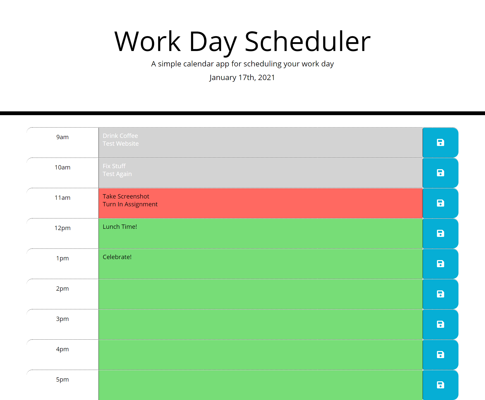

# Work Day Scheduler

## Description
A simple planner for the hours of 9am-5pm. User can enter plans for each hour into the textarea, and after clicking the save button, the plans will be saved if page is refreshed or closed.

Work Day Scheduler is made using a combination of HTML, CSS, JavaScript and third party APIs. APIs used are Bootstrap, jQuery, Font Awesome, Google Fonts, and Moment.js.

### Screenshot

### Link
[Work Day Scheduler](https://albenchris.github.io/workday-scheduler/)